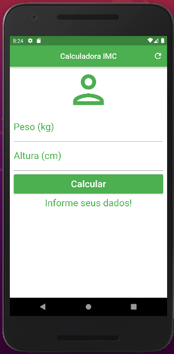

<h1 align="center">Calculadora_imc</h1>

<h1 align="center">
  
</h1>

# Topicos
- Descrição do projeto
- Linguagens usadas

## Descrição do projeto

  Projeto de uma calculadora de imc com origem a partir do Flutter.

  Aqui alguns recursos para voçê começar, caso esse seja seu primeiro 
  projeto Flutter.
- [Lab: Write your first Flutter app](https://docs.flutter.dev/get-started/codelab)
- [Cookbook: Useful Flutter samples](https://docs.flutter.dev/cookbook)

